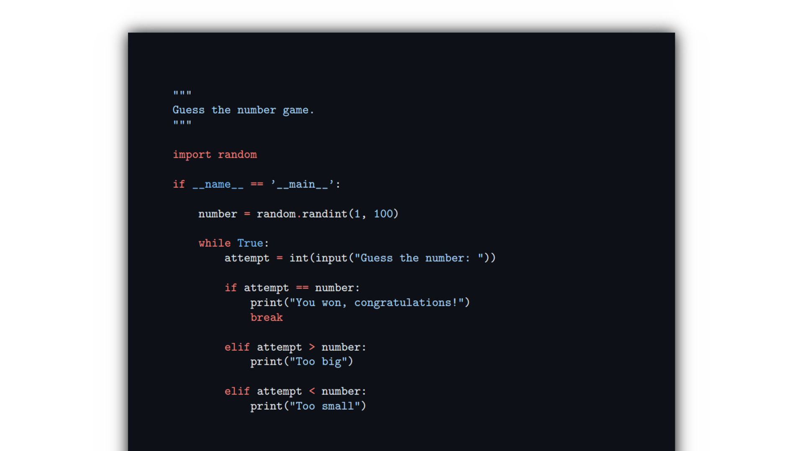

# Code to PDF

> Generate PDF documents from source code with syntax highlighting.

<p align="center">
    
</p>

## Motivation

I created this project because my school teacher preferred to get our homework as PDF files rather than source files. So I figured I’d automate it to save myself from copying the code in LibreOffice Writer for each homework.

## Requirements

- `pdflatex`

## Installation

```
pip install git+https://github.com/victorbnl/code-to-pdf
```

## Usage

### As a command-line application

```
usage: code-to-pdf [-h] [-s STYLE] [--font-size FONT_SIZE] [--linenos LINENOS] [--linenostep LINENOSTEP] [--top-margin TOP_MARGIN]
                   [--bottom-margin BOTTOM_MARGIN] [--left-margin LEFT_MARGIN] [--right-margin RIGHT_MARGIN]
                   source_file out_file

positional arguments:
  source_file           file to get source code from
  out_file              output PDF file

options:
  -h, --help            show this help message and exit
  -s STYLE, --style STYLE
                        pygments style (see https://pygments.org/styles/)
  --font-size FONT_SIZE
                        document font size
  --linenos LINENOS     whether or not to display line numbers
  --linenostep LINENOSTEP
                        if `linenos` is enabled, print every n-th line number
  --top-margin TOP_MARGIN
                        document top margin
  --bottom-margin BOTTOM_MARGIN
                        document bottom margin
  --left-margin LEFT_MARGIN
                        document left margin
  --right-margin RIGHT_MARGIN
                        document right margin
```

**Note:** See [Pygments’ documentation](https://pygments.org/styles/) for a list of available styles.

### As a module

```python
>>> import code_to_pdf
>>> source = "print('Hello world!')"
>>> options = code_to_pdf.Options()
>>> pdf_content = code_to_pdf.build(source, options=options)
>>> with open('output.pdf', 'wb') as output_file:
...     output_file.write(pdf_content)
```

## Thanks to

- [Pygments](https://pygments.org/), which this project highly relies upon
